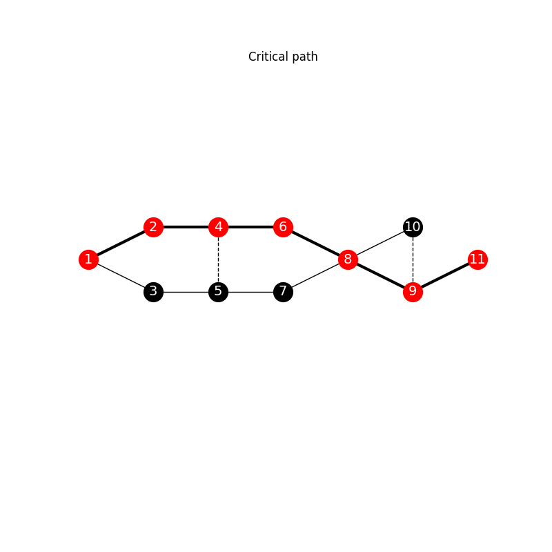

# :warning: Critical path

The code receives a process graph. The edges should represent activities (with the 
weight representing the activity time), and the vertices represent process states. 
As output, it prints the minimum and maximum completion times for each activity, 
as well as the critical path. The critical path is also represented in an image.

To run the code, execute as follows

```bash
<python> critical_path.py <input_file>
```

An example of input file is *crit.txt*, that produces 



```
      node    minTime    maxTime      slack
         9       36.0       36.0        0.0
         7       20.0       22.0        2.0
         3        5.0       12.0        7.0
        11       43.0       43.0        0.0
         5       16.0       18.0        2.0
         4       16.0       16.0        0.0
        10       34.0       36.0        2.0
         8       30.0       30.0        0.0
         2        7.0        7.0        0.0
         6       27.0       27.0        0.0
         1          0        0.0        0.0

Critical Path : [ 1 2 4 6 8 9 11 ]
```
:squid: [github.com/gian-teixeira/squid](https://github.com/gian-teixeira/squid)
